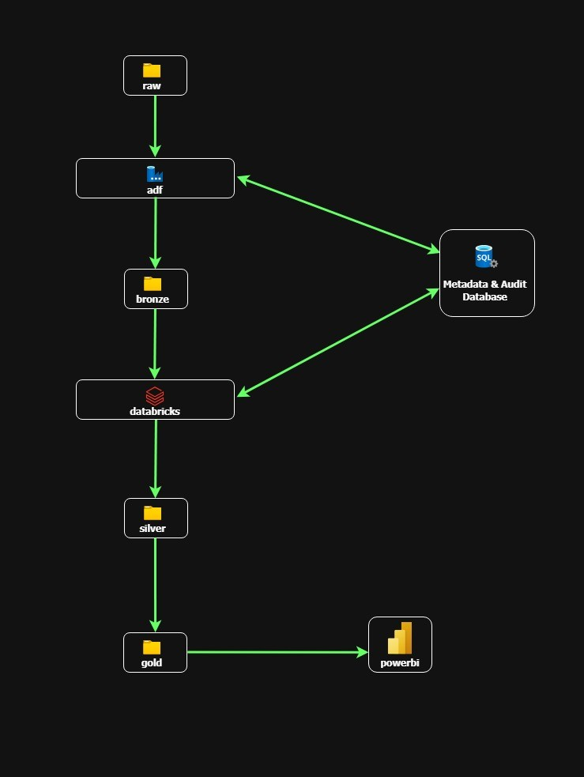
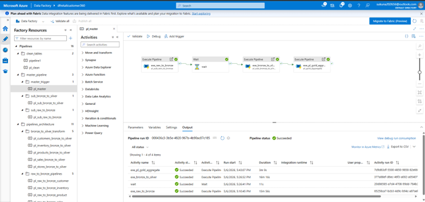
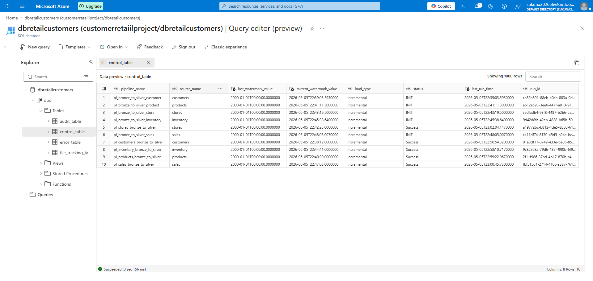
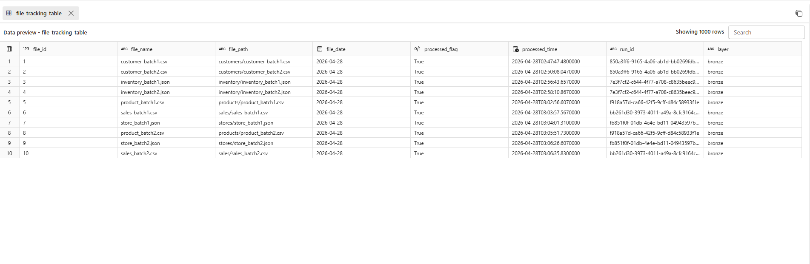
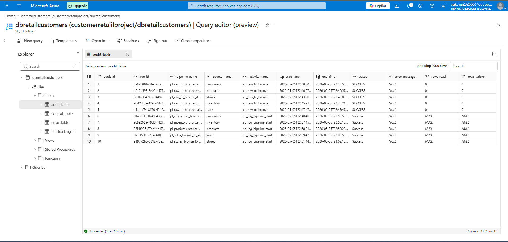
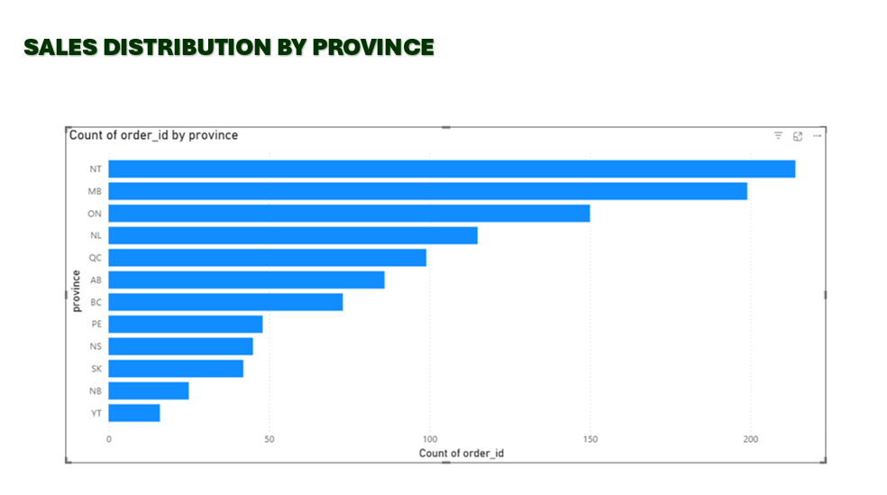
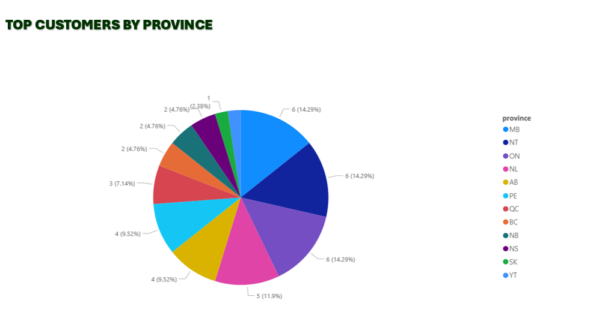
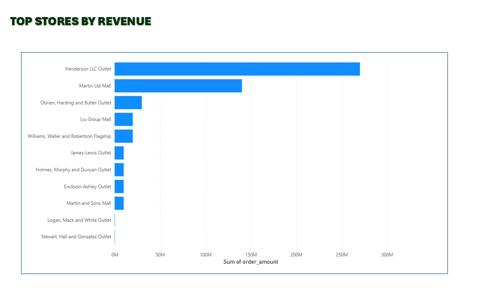
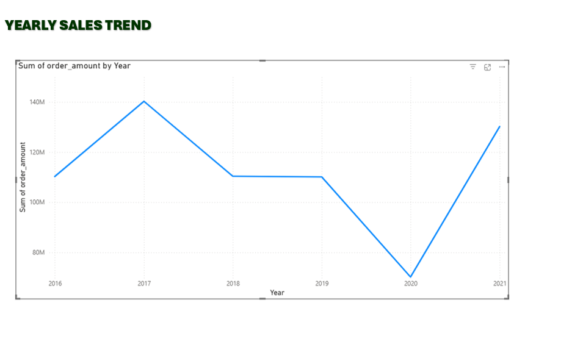

# Enterprise Retail Analytics Pipeline (Customer 360)

Built an end-to-end Azure Retail Customer 360 Data Platform using Azure Data Factory, Databricks, ADLS Gen2, SQL, and Power BI. Implemented Bronze, Silver, and Gold lakehouse layers for scalable retail data ingestion, transformation, validation, and analytical reporting workflows. Designed metadata-driven orchestration, watermark-based incremental processing, Delta Lake transformations, and centralized monitoring architecture.

---

# Architecture Diagram

---

# Technology Stack

- Azure Data Factory (ADF)
- Azure Databricks
- Azure Data Lake Storage Gen2
- SQL
- Delta Lake
- PySpark
- Power BI

---

# Key Features

- Metadata-driven orchestration framework
- Incremental watermark-based ingestion
- Bronze, Silver, and Gold lakehouse architecture
- Distributed PySpark transformation workflows
- Delta Lake merge and upsert processing
- Rejected record quarantine framework
- Centralized monitoring and audit logging
- Star-schema analytical modeling

---

# End-to-End Pipeline Flow

1. Source retail data ingestion  
2. ADF orchestration workflows  
3. Bronze raw data storage in ADLS Gen2  
4. Databricks cleansing and validation workflows  
5. Silver curated processing layer  
6. Gold dimensional analytics layer  
7. Power BI reporting and dashboard analytics  

---

# Project Screenshots

## Master Pipeline

---

## Metadata Control Table

---

## File Tracking Table

---

## Audit Monitoring Table

# Power BI Dashboard Visualizations

## Sales Distribution by Province

---

## Top Customers

---

## Top Stores

---

## Yearly Sales Trends

